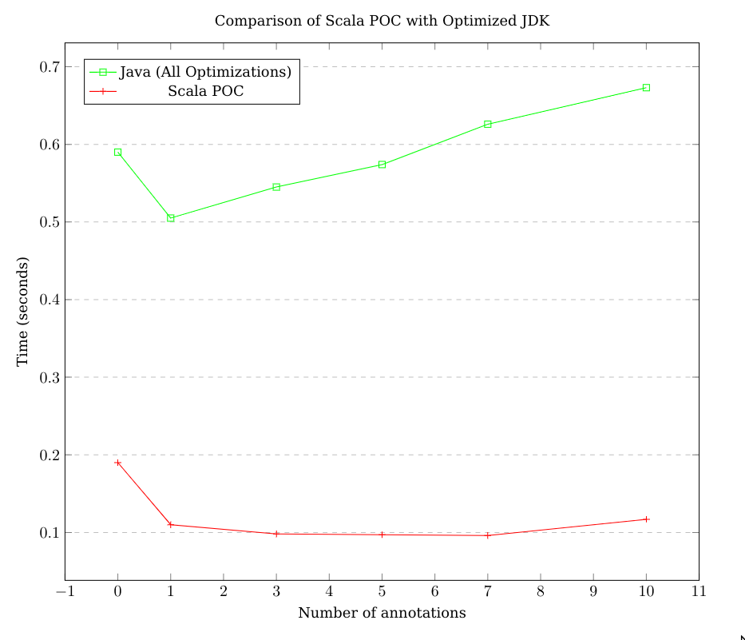
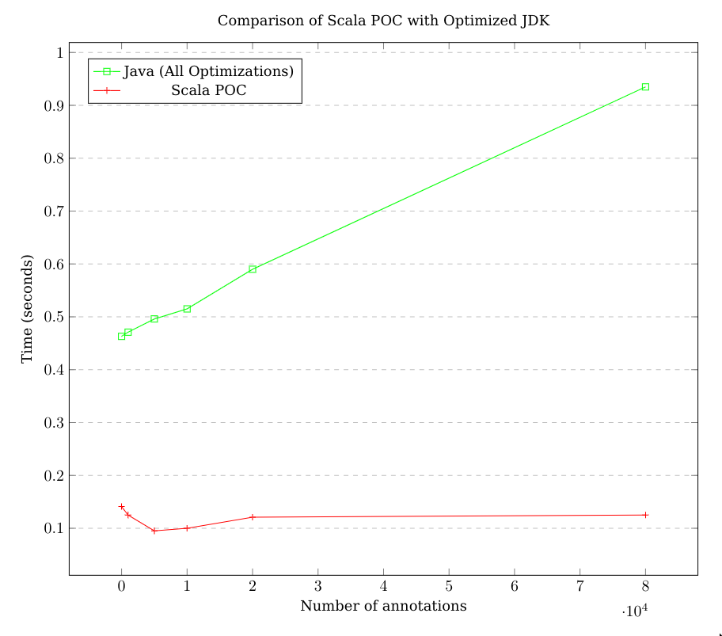

# Alvarium Scala SDK POC

This repository is a POC for a Scala sdk of the Alvarium project.

There are also some enhancements ideas : 

- Applies all the optimisations as discussed in Alvarium's java sdk issue [#136](https://github.com/project-alvarium/alvarium-sdk-java/issues/136)
- Replace Alvarium's `Annotators` with `EnvironmentCheckers`, and create the annotations in the engine to avoid code duplication
- `Sdk` interface is called `AlvariumEngine`
- Annotate and publish data asynchronously
- It is easy to inject its own signer/hasher/serializer
- Safe way to pass properties to checkers when annotating data


PLEASE Open an issue if you want more documentation and more details about what was done, i'm doing this repo mostly for fun.

# Getting started

## Install

Run `./mill assembly` then get the output jar located in `out/assembly.dest/out.jar`.

## Configure

Use the builder to configure the Alvarium's engine

```scala
val engine = new AlvariumEngineBuilder {
  override val signer: SigningType = SigningType.Ed25519(FileKey(Path.of("./res/private.key")), keepSignerInMemory = true)
  
  override val stream: StreamType = StreamType.Mqtt(
    Endpoint("mosquitto-server", "tcp", 1883),
    clientId = UUID.randomUUID().toString,
    qos = 0,
    isClean = false,
    crendentials = None
  )("alvarium-topic")
  
  override val hasher: HasherType = HasherType.MessageDigest("SHA-256")
  
  addCheck(new TpmChecker())
  addCheck(new TlsChecker(socket = /*TLS socket*/))
  addCheck(new PredicateChecker[String](data => isValidJson(data)), alias = "data is a valid json")
  addCheck(new PredicateChecker[Int](input => input == 3), alias = "input is equal to 3")
  addCheck(new PkiChecker())
  addCheck(new MyCustomCheckerType())
  
}.build()
```

Then annotate the data based on the action performed : 

```scala
val future = engine.annotate(AlvariumActionKind.Publish, data)(
  Checker[PkiChecker] -> PkiCheckerProps(data),
  Checker[PredicateChecker]("input is equal to 3") -> PredicateCheckerProps(4),
  Checker[PredicateChecker]("data is a valid json") -> PredicateCheckerProps(new String(data))
)
```

The annotation is then performed asynchronously. You can blockingly await for the annotation to be published by using `Await.result()` : 

```scala
val annotations = Await.result(future, 5.seconds) //returns the bundle that has been sent to the provided stream.
```

# Performances

Here is the comparison of performances enhancement compared to Alvarium Java SDK [Performances Report's Optimisations ideas](https://github.com/project-alvarium/alvarium-sdk-java/files/15496199/Alvarium_Performances_Report.pdf)



